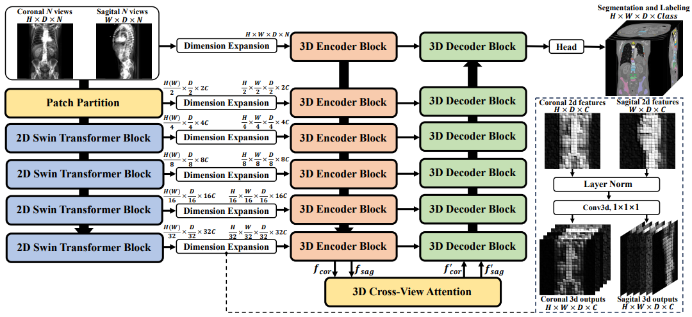
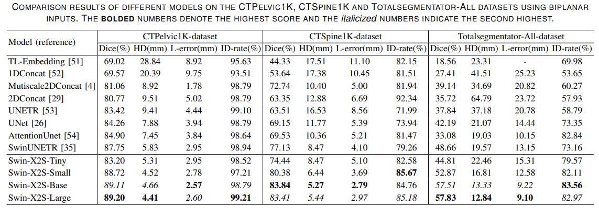
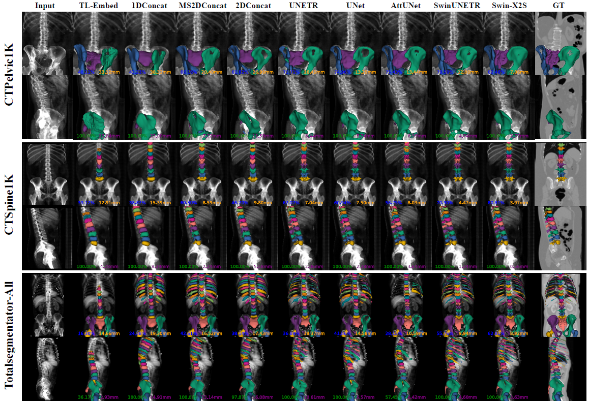
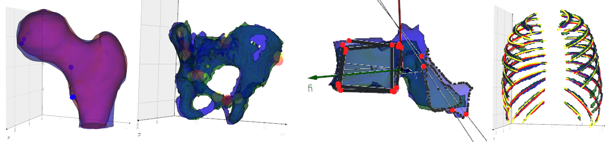

# Swin-X2S: Reconstructing 3D Shape from 2D Biplanar X-ray with Swin Transformers
 by Kuan Liu et al.

## Introduction
This repository is the official implementation code for our paper "Swin-X2S: Reconstructing 3D Shape from 2D Biplanar X-ray with Swin Transformers".



## Get Started
This repository is based on Python 3.11.5 + PyTorch 2.1.0+cu118 + MONAI 1.3.0.

### Training WorkFlow
1. Establish DigitallyReconstructedRadiograph and IdentityDirection process program.

We provide DigitallyReconstructedRadiograph.exe and IdentityDirection.exe to directly generate required datasets.
If exe can not run on your device, we also provide DigitallyReconstructedRadiograph.cpp and IdentityDirection.cpp based on Insight Toolkit (ITK https://itk.org/). 
Use C++ compiler to compile executable programs according to your system.

2. Preprocess the data to DRR projection images and corresponding CT segmentations, five datasets correspond to five preprocessing files respectively. 

```c
- Totalsegmentator: https://github.com/StanfordMIMI/TotalSegmentatorV2
python ./dataset/dataset_totalsegmentator.py --segment_type all/femur/pelvic/spine/rib  --size 160 --num_aug 1 --id_exe_file ./dataset/IdentityDirection.exe --drr_exe_file ./dataset/DigitallyReconstructedRadiograph.exe --raw_file ./Totalsegmentator_dataset_v201 --input_file ./dataset/Totalsegmentator_dataset_all_input --midout_file ./dataset/Totalsegmentator_dataset_all_mid --output_file ./dataset/Totalsegmentator_dataset_output
```

```c
- CTPelvic1K: https://github.com/MIRACLE-Center/CTPelvic1K
python ./dataset/dataset_pelvic1k.py --size 160 --num_aug 1 --id_exe_file ./dataset/IdentityDirection.exe --drr_exe_file ./dataset/DigitallyReconstructedRadiograph.exe --raw_file ./dataset/CTPelvic1K_raw --input_file ./dataset/CTPelvic1K_input --midout_file ./dataset/CTPelvic1K_mid --output_file ./dataset/CTPelvic1K_output
```

```c
- CTSpine1K: https://github.com/MIRACLE-Center/CTSpine1K
python ./dataset/dataset_spine1k.py --size 160 --num_aug 1 --id_exe_file ./dataset/IdentityDirection.exe --drr_exe_file ./dataset/DigitallyReconstructedRadiograph.exe --input_file ./dataset/CTSpine1K_input --midout_file ./dataset/CTSpine1K_mid --output_file ./dataset/CTSpine1K_output
```

```c
- VerSe'19: https://github.com/anjany/verse
python ./dataset/dataset_verse19.py --size 160 --num_aug 5 --id_exe_file ./dataset/IdentityDirection.exe --drr_exe_file ./dataset/DigitallyReconstructedRadiograph.exe --input_file ./dataset/verse19_raw --midout_file ./dataset/verse19_mid --output_file ./dataset/verse19_output
```

```c
- RibSeg v2: https://github.com/M3DV/RibSeg
python ./dataset/dataset_ribseg.py --size 160 --num_aug 2 --id_exe_file ./dataset/IdentityDirection.exe --drr_exe_file ./dataset/DigitallyReconstructedRadiograph.exe --input_file ./dataset/RibFrac_raw --midout_file ./dataset/RibFrac_mid --output_file ./dataset/RibFrac_output
```

3. Swin-X2S network training

We provide training scripts for different models and datasets. 
- `--model_name` includes four variants of Swin-X2S-Tiny, Swin-X2S-Small, Swin-X2S-Base, Swin-X2S-Large and other comparisons: 
Unet, UNETR, SwinUNETR, AttentionUnet, OneDConcat, TwoDPermuteConcat, MultiScale2DPermuteConcat, CustomAutoEncoder.
- Set `--data_dir` to select dataset for training, data_dir should be the format of data_list.json.
- Use `--distributed` to activate multiple GPUs training.
- Set `--use_ssl_pretrained` to use pre-trained weights.
- First epoch after launch the server could be slow, but should be fast later.


```c
bash scripts/models/CTPelvic1K/pelvic1k_attentionunet_view1.sh
bash scripts/models/CTSpine1K/spine1k_swinx2sbase_view1.sh
bash scripts/models/Total_all/totalall_unet_view1.sh

bash scripts/subsets/totalfemur_swinx2sbase_view1.sh
bash scripts/subsets/verse19_swinx2sbase_view1.sh
```

### Inference WorkFlow

An example of using Swin-X2S-Base model to inference Totalsegmentator-all dataset with biplanar DRR inputs.
```c
python test.py --weight_dir="./weights" --weight_model_name="totalall_swinx2sbase_view1.pt" --model_name=Swin-X2S-Base --data_dir="./dataset/Totalsegmentator_all/data_list.json" --in_channels=1 --out_channels=55 --exp_name="totalall_swinx2sbase_view1"
```
- `--weight_model_name` is trained weights, corresponds to `--model_name`
- Inputs, predictions and segmentation labels save in ./outputs/`--exp_name`, all in nii.gz format.

## Results
We evaluated the reconstruction performance of several existing methods on CTPelvic1K, CTSpine1K, and Totalsegmentator-All dataset..



The visualization samples of Totalsegmentator-All. The first and last columns denote biplane X-ray inputs and GT respectively.


You can visualize comparison reconstruction samples. We provide some samples in visualization folders (nii.gz format)
```c
python ./visualization/visualiztion_models.py
python ./visualization/visualization_subsets.py
python ./visualization/visualization_ablation.py
```

You can visualize 3D results in 3D Slicer (https://www.slicer.org/).
Run the following command in 3D Slicer Python Console.
```c
exec(open('./visualization/slicer_visualization_3d.py').read(), {'file_path': './visualization/vis_result/subsets/FIG1'})
```

## Morphometry
This Section is partly derived from [xrayto3D-morphometry](https://github.com/naamiinepal/xrayto3D-morphometry).
We adopt automated clinical parameters evaluation pipelines for four anatomies.
Please note label_idx may need to adjust according to different datasets. 

### Femur Morphometry
Pietro Cerveri, Mario Marchente, Ward Bartels, Kristoff Corten, Jean-Pierre Simon, and Alfonso Manzotti. Automated method or computing the morphological and clinical parameters of the proximal femur using heuristic modeling techniques. Annals of Biomedical Engineering, 38:1752–1766, 2010.
```c
python ./morphometry/femur_morphometry.py --nifti_file="./outputs/totalall" --output_file="./visualization/vis_result/morph/totalall_femur" --is_show
```
### Pelvic Landmarks
Maximilian CM Fischer, Felix Krooß, Juliana Habor, and Klaus Radermacher. A robust method for automatic identification of landmarks on surface models of the pelvis. Scientific Reports, 9(1):13322, 2019.
```c
python ./morphometry/hip_landmarks.py --nifti_file="./outputs/totalall" --output_file="./visualization/vis_result/morph/totalall_pelvic" --is_show
```
### Vertebra Morphometry
Luca Di Angelo and Paolo Di Stefano. A new method for the automatic identification of the dimensional features of vertebrae. Computer methods and programs in biomedicine, 121(1):36–48, 2015.
```c
python ./morphometry/vertebra_morphometry.py --nifti_file="./outputs/totalall" --output_file="./visualization/vis_result/morph/totalall_spine" --is_show
```
### Rib Centerline
Liang Jin, Shixuan Gu, Donglai Wei, Jason Ken Adhinarta, Kaiming Kuang, Yongjie Jessica Zhang, Hanspeter Pfister, Bingbing Ni, Jiancheng Yang, and Ming Li. Ribseg v2: A large-scale benchmark for rib labeling and anatomical centerline extraction. IEEE Transactions on Medical Imaging, 2023.
```c
python ./morphometry/rib_centerline.py --nifti_file="./outputs/totalall" --output_file="./visualization/vis_result/morph/totalall_rib" --is_show
```

## Dataset Link
- Totalsegmentator: https://github.com/StanfordMIMI/TotalSegmentatorV2
- CTPelvic1K: https://github.com/MIRACLE-Center/CTPelvic1K
- CTSpine1K: https://github.com/MIRACLE-Center/CTSpine1K
- VerSe'19: https://github.com/anjany/verse
- RibSeg v2: https://github.com/M3DV/RibSeg

## Acknowledgment
This Repo is based on [xrayto3D-benchmark](https://github.com/naamiinepal/xrayto3D-benchmark), [SwinTransformer](https://github.com/microsoft/Swin-Transformer), [SwinMM](https://github.com/UCSC-VLAA/SwinMM), [MONAI](https://monai.io/).
